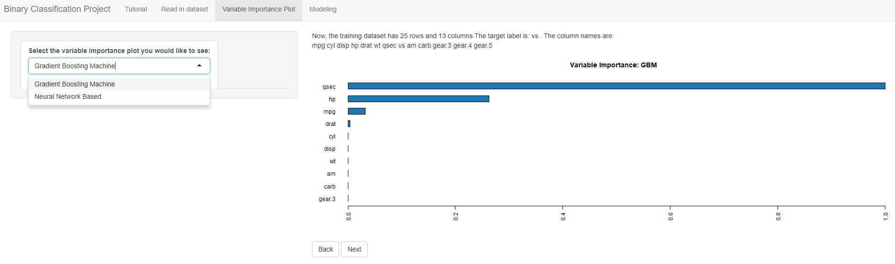
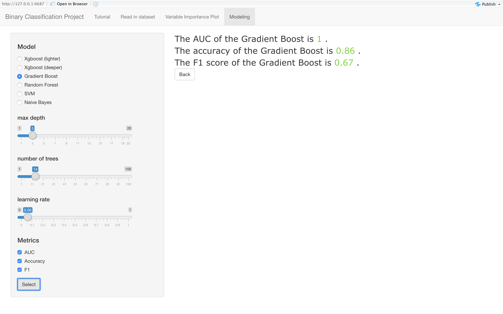

```{r setup, include=FALSE}
knitr::opts_chunk$set(echo = TRUE)
```
# Workflow - ML Pipeline for Binary Classification


This project allows users to perform a quick processing-preliminary modeling pipeline for **Binary Classification**. The three components for this pipeline are preprocessing the data, visualization of feature importance plots, and fitting models and printing results.

This walkthrough is based on mtcars dataset. The shiny app first reads in the dataset, preprocesses variables (one hot encode, convert to ordinal levels, and normalize variables) according to the user’s choice. After this transformation, the user is then taken to the second page in which feature importance plots are shown according to Gradient Boosting Machine or Neural Networks, again according to the user’s choice. The user should then proceed to the third page in which the user can tune parameters for our listed models on the page according to any of the three metrics (AUC, Accuracy, and F1 score). 

**input**: The input needs to be a clean dataset (no missing values, no unneeded columns, etc.). For example, if we want to use the mtcars dataset, we need to remove the "model" column.   

**Required Package**: tidyverse, caret, ggplot2, markdown, h2o, shiny, preprocessHTT (our own package, files are available [here](https://github.com/PHP-2560/r-package-after-school-troll-time/tree/master/packagefiles))

## ‘Read in dataset’ tab

 Use the ‘Browse…’ button to navigate to the location of the file and read it. In the case of mtcars, once you have read in the data after upload complete bar is filled, you will find a header of the dataset on the right main panel. You will find that by default the ‘Header’ checkbox is selected. When this checkbox is selected, the first row of the dataset will be taken as the row describing variable names. If you uncheck this box, you will find that the feature names are now given in the form of ‘Vn’ and, in the case of mtcars, the first row of the data is erroneously read in as a data entry.   

Let's use mtcars dataset as an example. Since the dataset contains header, we have to select header when we load the dataset    


Below in the main column you will see six interactive components. The first three fall into a group; the following two follows a group, and you have a final confirm button.   

The first three columns allow you to select your preprocessing. You may select multiple columns for each of these transformations. Be careful not to select a column for multiple preprocessors; they are not intended to be mutually compatible conceptually or functionally, and selecting a variable for multiple transformations at the same time will result in an error.   

The following two interactive components asks the user to select the response variable and the percentage of data retained for testing, respectively. You **cannot one-hot encode the target column**, as this makes neither conceptual nor in this implementation functional sense. Moreover, target columns can only be selected from binary columns, since this model is for binary classification.  

For example. using mtcars, you can preprocess the dataset with following settings:  
 

Hitting the confirm button will take you to the second tab; if you revisit the first tab, you will find that the header of the dataset shows preprocessed columns. The dataset is passed onto the following tabs as you have specified in this tab.

Please note: every time you would like to read a new file, please refresh the page.

## ‘Variable Importance Plot’ tab

You will see variable importance ranks gathered from two different methods: Gradient Boosting Machine and Neural Network based. Under the hood a GBM or a Neural Network model is being trained mapping from the predictors to the response variables, and the variable importance plot is based on this model. Because of neural networks have stochastic components including starting points, learning rates, batch size and so forth, the importances from Neural Network Based methods are not fixed––they may change within each selection and thus may change the order of variable importance. The Gradient Boosting Machine, on the other hand, should produce a fixed list of importances.

The Variable importance plot can provide a list of the most significant variables. The top variables contribute more to the model than the bottom ones and also have high predictive power in classifying the target variable. You might be able to gain some insights on feature selection when you want to build a more complex model afterward. However, no feature selection is performed here. No features are being dropped based on the importance. All features are being sent to the next tab for modeling.   

    
*The models and the plots are functionalities of h2o, an open-source machine learning platform.

## ‘Modeling’ tab

Having preprocessed and seen the variable importance plot, you should proceed to the ‘Modeling’ tab.  There you can select a model you want to fit from seven ML modeling options - Xgboost (lighter), Xgboost(deeper), Gradient Boost, Random Forest, SVM, and Naive Bayes. Except the Naive Bayes model, which does not have parameters to tune, you will see the parameters you may tune for each option. Additionally, you can evaluate the performance of your model through three metrics - AUC, accuracy and F1 score. You can select concurrently any of the metrics. Once you have selected a model and metrics, simply click ‘Select’, and you will see the model performance on the right main panel. The AUC of the SVM model is not available, and it will give a NaN. You can experiment with those ML modeling options and figure out the best algorithm for your problem at ease.   


*The models are functionalities of h2o, an open-source machine learning platform. 


## At the End

The idea of this shiny app is to generate a machine learning model pipeline to choose the best model for binary classification problems. It is designed to ease the tasks of data scientists. Building better models requires expertise from cleansing the data to feature engineering, designing the architectures to parameter optimization. To ease this process and make it efficient in terms of time and effort, this Shiny App helps to automate these workloads. This shiny app pipeline serves as a reference and hopefully provides you with some insights on your project. We hope it will be helpful to you in building better models afterward. 

**Acknowledgement:** 

This shiny app was created by Sida(Mickey) Li, Hao Xi, Yijie Zhu, and Chu Wu. We sincerely appreciate Dr. Adam Sullivan’s comments and suggestions that allowed us to greatly improve the quality of the shiny app.

